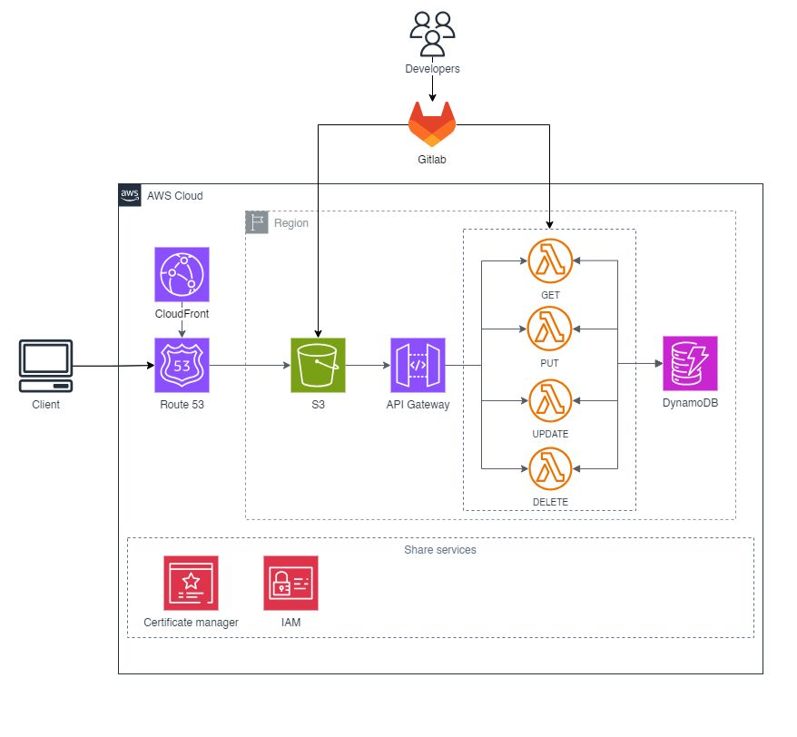

# Job portal frontend

## 1. Overview
My full stack job portal web application that allows employees to find, apply occupations or research enterprise in the field of Information Technology. This is my self-learning project that I developed during my learning in ReactJS, NodeJS, TailwindCSS and AWS Services.

This repository serves as a front-end user interface.

Link to the backend: [https://github.com/stillxthahn/Job-Portal-Backend](https://github.com/stillxthahn/Job-Portal-Backend)

## 2. Services
- Frontend: ReactJS, TailwindCSS, Ant-Design.

- AWS Services: AWS Lambda, Amazon CloudFront, Route53, AWS DynamoDB, AWS Certificate Manager, IAM.

## 3. How to use
There are two distinctive roles for users: Employee and Employer

* Employee
  * View companys
  * Search for occupations, with **Skill, City**, and **Keyword** field
  * Apply CVs for suitable jobs
  * Sig up as a employer
* Employer
  * With basic utilizations of employee, an employer can further log in or sign up as an administrator to manange their own company, jobs and CVs applied

#### Initial login accounts
| Email     | Password |
| :-------- | :------- | 
| `company01@gmail.com` | `123456` | 
| `company02@gmail.com` | `123456` | 
| `company03@gmail.com` | `123456` |  
| `company04@gmail.com` | `123456` | 
| `company05@gmail.com` | `123456` | 
| `company06@gmail.com` | `123456` | 
| `company07@gmail.com` | `123456` | 
| `company08@gmail.com` | `123456` | 
| `company09@gmail.com` | `123456` | 
